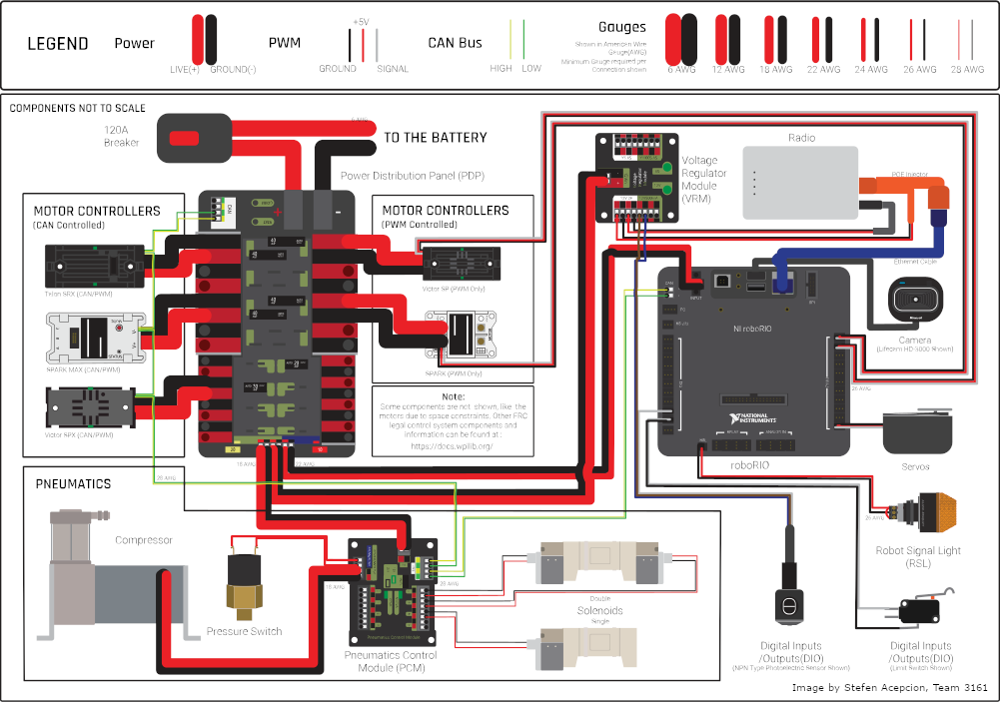

# Hardware Software Specification

Robot Name: __Metal Melody__

<!-- TOC -->
* [Hardware Software Specification](#hardware-software-specification)
  * [Software Repository](#software-repository)
  * [Description](#description)
    * [Swerve Drive Mechanism](#swerve-drive-mechanism)
    * [Game Piece Handling Mechanisms](#game-piece-handling-mechanisms)
      * [Lift](#lift)
      * [Intake Pivot](#intake-pivot)
      * [Intake Feeder](#intake-feeder)
  * [Program Priorities](#program-priorities)
  * [Motion Control Rules](#motion-control-rules)
    * [Lift and Intake Rules](#lift-and-intake-rules)
  * [Robot Controllers](#robot-controllers)
  * [Motor Controllers](#motor-controllers)
  * [Discrete Sensors](#discrete-sensors)
    * [Beam Break Sensor](#beam-break-sensor)
  * [Miscellaneous Device Power](#miscellaneous-device-power)
    * [OpenMesh Radio](#openmesh-radio)
    * [Inertial Measurement Unit](#inertial-measurement-unit)
    * [Camera](#camera)
  * [Useful Links](#useful-links)
<!-- TOC -->

## Software Repository
The robot source code can be found in this repository: [Competition Robot Code](https://github.com/SteelRidgeRobotics/2024MetalMelody)

## Description
This document describes the interface between the hardware and software of the competition robot for the 2024 Crescendo FRC Season.
The robot consists of a swerve drive chassis, an elevator mechanism, and an intake.
The swerve drive uses the Swerve Drive Specialties MK4i module arranged on a square chassis.
The elevator mechanism, known as the lift, consists of two telescoping lifts that support the Touch It, Own It (TITO) intake mechanism.
The lift also includes a pair of hooks that can allow the robot to climb the chain in the end game.
The intake uses horizontal rollers that grab and hold on to the game piece.
The intake pivots between a retracted position inside the frame perimeter and a deployed position that reaches over the bumper.

### Swerve Drive Mechanism
The swerve drive utilizes the Swerve Drive Specialties MK4i module.
The steering gear ratio of the MK4i is 150/7:1.
The drive gear ratio of the MK4i is 27/4:1.
This is the V2, or medium speed, version of the module.
Each steering mechanism includes a CANcoder absolute position encoder.

[SDS MK4i Webpage](https://www.swervedrivespecialties.com/products/mk4i-swerve-module?variant=39598777172081)

### Game Piece Handling Mechanisms
The game piece handling portion of the robot consists of the lift and the intake.
Game piece handling is managed through three degrees of freedom (DoF).

#### Lift
The lift is an elevator system that supports the intake mechanism and serves as the climber mechanism.
The lift consists of a pair of telescoping booms that extend vertically.
Each vertical boom is driven by a motor and a 15.31:1 gearbox.
The intake is suspended between the booms.
Each boom hosts a hook that can snag the chain on the stage so the robot can climb at the end of the match.

Each boom is spring-loaded.
The springs extend each boom to its maximum height with approximately 20 lbs (89 N) of force.
Each boom is retracted using a 3 mm Dyneema (or equivalent) rope attached to a spindle.
The booms are mechanically linked together through a continuous piece of hex shaft located between the gearboxes.
The total extension force experienced by the motor at the spindles is approximately 180 N.

The home position of the lift is the fully retracted position.
However, the's starting configuration is the fully extended position.
A hard stop exists at the lift's home position.
To prevent the lift from tripping its circuit breakers, a supply current limit is required in case the lift is driven into its hard stop.

#### Intake Pivot
The intake rotates around a pivot at the top of the lift.
The pivot is driven by a single motor and 50:1 gearbox.
The pivot will rotate the intake to a predetermined rotation position along its range of motion.
The retracted, or parked, position is at one extreme of the pivot's range of motion where the intake is fully inside the robot's frame perimeter.
The extended, or deployed, position is at the other extreme of the pivot's range of motion.
The extended position is used when capturing game pieces directly off the floor.
A secondary retracted position is used when scoring game pieces into the amp.
A hard stop exists at the fully retracted position.
To prevent the lift from tripping its circuit breakers, a supply current limit is required in case the lift is driven into its hard stop.
In the preferred control implementation, the control algorithm can rotate the pivot to an arbitrary angle and hold the intake in that position for the duration of a match. 
The home position of the pivot is the fully retracted position. 
The robot will start the match in the fully retracted position, so the robot code can set this as the home position during robot initialization.

#### Intake Feeder
The intake feeder will be driven by a single motor and a 5:1 gearbox.
A beam break sensor will detect when the intake is populated with a game piece.

## Program Priorities
The various robot capabilities will be developed using the following priority list.
This list should be used to guide trade off decisions to ensure that lower priority subsystems are not preventing progress on higher priority subsystems.
1. Drivetrain, Chassis & Bumpers
2. Touch It, Own It (TIOI) Intake
3. Amplifier Lift
4. Climber
5. Other

"Other" development efforts include scoring in the TRAP and utilizing vision to improve teleop performance.

## Motion Control Rules
The high level motion control rules describe the allowed interactions between the various robot subsystems.

### Lift and Intake Rules
These rule govern the interaction between the lift and intake mechanisms.
1. Only move one mechanism at a time.
2. Only move the intake pivot when the lift is in the low position.
3. Only raise the lift when the intake is not in the retracted position.
4. Automatically retract the intake when a game piece is captured by the intake.
5. Run the feeder in the in capture direction when the intake is empty and not in the retracted position.

## Robot Controllers
The robot implements a CTRE style robot control system.
A generic CTRE control system is shown below.

This robot uses a single roboRIO 2 as the only robot controller.
The robot code is implemented in Python using the 2024 RobotPy framework.
Major software versions are shown in the following table.
Motor controller and sensor software versions are listed elsewhere in this document.

| Software Component        | Version       |
|---------------------------|---------------|
| RobotRIO Image            | 2024 v2.1     |
| Python                    | 3.11.7        |
| Power Distribution Module | 1.4           |
| OpenMesh Radio            | _TBD_         |
| CTRE Motion Control       | Phoenix 6 Pro |

| Python Packages         | Version    |
|-------------------------|------------|
| robotpy                 | 2024.3.1.0 |
| frc6343                 | 0.2        |
 
Installed Robotpy Modules: commands2, navx, pathplannerlib, phoenix6

## Motor Controllers
The following table lists all the motor controllers used in the robot.

| Function              | Controller  | FW         | Motor                                                                                       | CAN Addr | PDP Port | Breaker |
|-----------------------|-------------|------------|---------------------------------------------------------------------------------------------|:--------:|:--------:|:-------:|
| Drive Front Left      | Talon FX    | 2024.2.0.0 | [Kraken X60](https://docs.wcproducts.com/kraken-x60/kraken-x60-motor/overview-and-features) |    1     |    13    |  40 A   |
| Drive Rear Left       | Talon FX    | 2024.2.0.0 | [Kraken X60](https://docs.wcproducts.com/kraken-x60/kraken-x60-motor/overview-and-features) |    2     |    14    |  40 A   |
| Drive Front Right     | Talon FX    | 2024.2.0.0 | [Kraken X60](https://docs.wcproducts.com/kraken-x60/kraken-x60-motor/overview-and-features) |    3     |    12    |  40 A   |
| Drive Rear Right      | Talon FX    | 2024.2.0.0 | [Kraken X60](https://docs.wcproducts.com/kraken-x60/kraken-x60-motor/overview-and-features) |    4     |    15    |  40 A   |
| Direction Front Left  | Talon FX    | 2024.2.0.0 | [Kraken X60](https://docs.wcproducts.com/kraken-x60/kraken-x60-motor/overview-and-features) |    5     |    10    |  30 A   |
| Direction Rear Left   | Talon FX    | 2024.2.0.0 | [Kraken X60](https://docs.wcproducts.com/kraken-x60/kraken-x60-motor/overview-and-features) |    6     |    9     |  30 A   |
| Direction Front Right | Talon FX    | 2024.2.0.0 | [Kraken X60](https://docs.wcproducts.com/kraken-x60/kraken-x60-motor/overview-and-features) |    7     |    11    |  30 A   |
| Direction Rear Right  | Talon FX    | 2024.2.0.0 | [Kraken X60](https://docs.wcproducts.com/kraken-x60/kraken-x60-motor/overview-and-features) |    8     |    8     |  30 A   |
| Lift Right            | Talon FX    | 2024.2.0.0 | [Kraken X60](https://docs.wcproducts.com/kraken-x60/kraken-x60-motor/overview-and-features) |    11    |    1     |  40 A   |
| Lift Left             | Talon FX    | 2024.2.0.0 | [Kraken X60](https://docs.wcproducts.com/kraken-x60/kraken-x60-motor/overview-and-features) |    12    |    0     |  40 A   |
| Intake Pivot          | Talon FX    | 2024.2.0.0 | [Falcon 500](https://www.vexrobotics.com/217-6515.html#attr-vex_docs_downloads)             |    9     |    3     |  40 A   |
| Intake Feeder         | Talon FX    | 2024.2.0.0 | [Falcon 500](https://www.vexrobotics.com/217-6515.html#attr-vex_docs_downloads)             |    10    |    2     |  40 A   |

## Discrete Sensors
The following table lists all the sensors used in the robot.

| Function                 | Sensor                                                       |     FW     | Associated Motor      | CAN Addr | PDP / VRM     |
|--------------------------|--------------------------------------------------------------|:----------:|-----------------------|:--------:|---------------|
| Steer Front Left Swerve  | [CANcoder](https://store.ctr-electronics.com/cancoder/)      | 2024.1.0.0 | Front Left Direction  |    10    | VRM 12V/500mA |
| Steer Rear Left Swerve   | [CANcoder](https://store.ctr-electronics.com/cancoder/)      | 2024.1.0.0 | Rear Left Direction   |    11    | VRM 12V/500mA |
| Steer Front Right Swerve | [CANcoder](https://store.ctr-electronics.com/cancoder/)      | 2024.1.0.0 | Front Right Direction |    12    | VRM 12V/500mA |
| Steer Rear Right Swerve  | [CANcoder](https://store.ctr-electronics.com/cancoder/)      | 2024.1.0.0 | Rear Right Direction  |    13    | VRM 12V/500mA |
| Intake Feeder Beam Break | [Adafruit Beam Break](https://www.adafruit.com/product/2168) |    ---     | Intake Feeder         |   ---    | VRM 5V/500mA  |

Notes:
1.  The VRM is powered through a 20 A breaker at **PDP Port 5**.
2.  Integrated sensors built into Falcon 500 motors are not included in this list. 

### Beam Break Sensor
A custom PCB assembly connects the two halves of the beam break sensor to a 5V port of the VRM and the forward limit switch of the intake feeder motor.
An LED on the PCB illuminates when 5V power is applied to the circuit and the beam is blocked.
The beam is blocked when a game piece is acquired by the intake.

[Sensor Product Page & Datasheet](https://www.adafruit.com/product/2168)

## Miscellaneous Devices
The following PDP ports are allocated to miscellaneous power devices

| Device          |     PDP Port     | Breaker / Fuse | Notes                              |
|-----------------|:----------------:|:--------------:|------------------------------------|
| Ethernet Switch |        5         |      20 A      | Not Used (Reserved for Future Use) |
| Limelight 3     |        6         |      20 A      | Not Used (Reserved for Future Use) |
| navX2-MXP       |       ---        |      ---       | Powered by roboRIO USB port        |
| Camera          |       ---        |      ---       | Powered by roboRIO USB port        |
| OpenMesh Radio  | Vbat VRM PCM PWR |      20 A      |                                    |

### OpenMesh Radio
The OpenMesh radio is connected directly to the Radio Power Module through an Ethernet cable.
Similarly, the Radio Power Module is connected directly to the RoboRIO.
The PDP's "Vbat VRM PCM PWR" output is connected to a Radio Power Module (RPM) with provides power to the radio through the Ethernet cable.

### Inertial Measurement Unit
A navX2-MXP Inertial Measurement Unit is used in conjunction with the swerve drive control system.
The module is attached to the roboRIO's MXP port and mounted directly to the roboRIO.
To improve brown out resistance, the navX2 is powered through a USB cable attached to the roboRIO.

### Camera
A forward-looking Microsoft HD-3000 USB camera is suspended between the arms of the lift and connected to a USB port on the RoboRIO.

## Useful Links
[2024 Crescendo Game Resources](https://www.firstinspires.org/resource-library/frc/competition-manual-qa-system)
